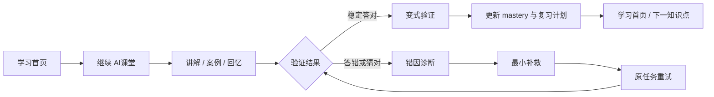
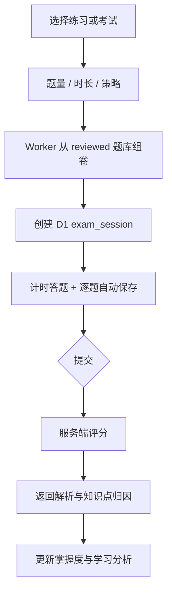
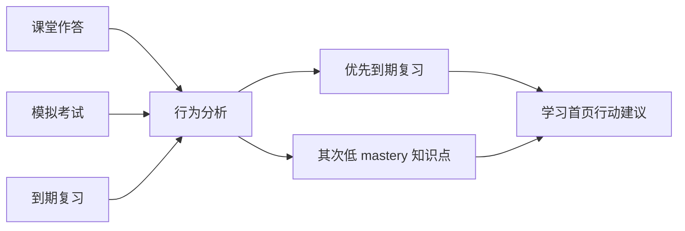

# RUNLOOP AI教学课堂 Web UI/UX V2

状态：可运行 v0，等待人工体验反馈  
范围：Private Alpha Web 端  
目标用户：以 PMP 备考为目标、需要连续深度学习与考试训练的个人学习者

## 1. 设计结论

RUNLOOP 不采用课程商城式首页，也不复制传统题库。Web 端定位为：

> 以 AI 课堂为中心，连接学习、练习、模拟考试和效果分析的个人备考工作台。

视觉命题：深墨蓝提供长时学习所需的安静与可信度，Runloop 蓝青色只标记行动、进度和反馈；页面以排版、留白和分隔线组织信息，避免卡片拼贴。

交互命题：任何一级模块最多一次点击可达；学习行为自动保存；系统反馈始终解释“为什么建议这一步”，不只显示分数。

## 2. 竞品分析

| 产品 | 值得借鉴 | RUNLOOP 转化 | 不直接照搬 |
|---|---|---|---|
| Coursera | 自适应内容、顺序与测评会根据学习表现实时变化 | mastery、错因、信心和猜测共同决定补救与练习优先级 | 大型课程目录、营销型首页 |
| edX | 课程大纲、完成标记、Resume Course、随时可达的 Progress 页面 | AI课堂保留阶段路线；首页继续上次位置；学习分析成为一级入口 | 复杂课程组织和证书体系 |
| Udemy | 练习模式与考试模式分离；考试计时；中途恢复；提交后统一复盘 | 智能练习与模拟考试分流；题号导航、自动保存、计时、提交后解析 | 讲师市场、评价与促销结构 |
| WCAG 2.2 | 可见焦点、可预测导航、触控目标和可访问认证 | 全局焦点环、移动端 ≥44px 高频操作、语义表单、减少动态效果支持 | 仅满足最低尺寸而忽略实际使用频率 |

资料依据：

- [Coursera：Adaptive Learning](https://www.coursera.org/articles/adaptive-learning)
- [Open edX Learner Guide：Checking Your Progress](https://edx.readthedocs.io/projects/open-edx-learner-guide/en/stable/SFD_check_progress.html)
- [Udemy：Personalize Your Learning Experience](https://support.udemy.com/hc/en-us/articles/17015232224023-Personalize-Your-Learning-Experience-on-Udemy)
- [Udemy：Practice Mode 与 Exam Mode](https://support.udemy.com/hc/en-us/articles/1500006547442-How-to-create-practice-tests-or-practice-test-courses)
- [Udemy：Taking Practice Tests](https://support.udemy.com/hc/en-us/articles/10985362294551-Taking-Practice-Tests)
- [W3C：WCAG 2.2 更新](https://www.w3.org/WAI/standards-guidelines/wcag/new-in-22/)

## 3. 信息架构与路由

| 路由 | 页面 | 核心任务 | 数据来源 |
|---|---|---|---|
| `/` | 学习首页 | 明确下一步、继续课堂、查看今日任务 | dashboard + insights |
| `/learn` | AI课堂 | 完成讲解到验证的教学状态机 | learning session |
| `/practice` | 智能练习 | 按薄弱点或均衡策略生成练习 | mastery + reviewed question bank |
| `/exam` | 模拟考试 | 配置试卷、查看历史、继续未完成考试 | exam sessions |
| `/exam/:examId` | 考试环境/复盘 | 计时作答、自动保存、提交、逐题复盘 | exam session + server keys after submit |
| `/reports` | 学习分析 | 读取行为趋势、薄弱知识点和行动建议 | attempts + exam results + review schedule |
| `/knowledge` | 知识检索 | 搜索知识点、考试重点和常见陷阱 | D1 FTS5 |
| `/login` | 登录 | Private Alpha 身份验证 | users + sessions |

桌面端固定顶部一级导航；移动端使用五项底部导航。知识检索属于辅助工具，放在桌面顶部和课堂底部操作区，不挤占移动端一级导航。

## 4. 关键流程

### 4.1 主学习闭环



### 4.2 智能组卷与考试



### 4.3 学习建议



## 5. 页面设计稿说明

高保真可点击稿即当前本地应用。各页面设计目标如下：

### 学习首页

- 第一屏只回答三个问题：学到哪里、掌握多少、下一步做什么。
- 深色主线区域是唯一强视觉锚点；其他内容用列表和分隔线组织。
- AI 建议必须包含建议动作和依据，不能只有“推荐”。

### AI课堂

- 保留阶段路线、主教学舞台和学习状态三层信息。
- 中央一次只出现一个教学任务，避免聊天记录和教学卡片竞争注意力。
- 提供沉浸模式、朗读、提示和知识检索；提示不直接公布答案。
- “答对但猜测”进入错因诊断，避免偶然正确被当成掌握。

### 智能练习

- 首先选择训练目标，再选择题量。
- 右侧展示真实薄弱点，让用户理解为何采用该策略。
- 练习生成后进入统一答题环境，减少学习不同交互规则的成本。

### 模拟考试

- 配置页解释考试规则；答题页隐藏全局学习导航干扰。
- 顶部固定计时与保存状态；左侧题号导航；中央单题作答。
- 提交后沿用同一页面进入复盘状态，题号用正确/错误语义色标记。

### 学习分析

- 摘要只显示可解释指标：作答量、正确率、响应时间、考试均分。
- 趋势图表达最近七天真实活动，不填充虚构数据。
- 薄弱点表格必须提供“练习”行动入口。

## 6. 组件规范

### 6.1 设计 Token

| Token | 值 | 用途 |
|---|---:|---|
| `--ink-strong` | `#071b33` | 标题、深色主视觉 |
| `--primary` | `#0b5fc6` | 主操作、导航激活、进度 |
| `--teal` | `#0aa8a1` | AI/正确进度辅助强调 |
| `--canvas` | `#f4f6f8` | 页面背景 |
| `--surface` | `#ffffff` | 工作面与交互容器 |
| `--line` | `#dfe5ea` | 分隔和低层级边界 |
| 圆角 | 8 / 12 / 16px | 控件 / 面板 / 主工作面 |
| 动效 | 160 / 180 / 240ms | 控件反馈 / 悬停 / 页面进入 |

### 6.2 核心组件

| 组件 | 变体 | 必须状态 |
|---|---|---|
| Button | primary / secondary / text | default、hover、focus、disabled、loading |
| Navigation | desktop top / mobile bottom | default、active、focus |
| StrategyOption | weakness / balanced | default、selected、focus |
| QuestionOption | exam / review | default、selected、correct、incorrect、disabled |
| Progress | mastery / chapter / exam | empty、partial、complete |
| PageState | loading / empty / error | 可读文案、恢复动作 |
| TeachingSurface | explain / recall / question / diagnosis | loading、responding、saved、error |
| DataRow | task / weakness / exam history | default、actionable、empty |

## 7. UI 状态与文案

| 状态 | 展示 | 恢复方式 |
|---|---|---|
| 首次无数据 | 解释需要完成一次作答才能分析 | 进入 AI课堂 |
| 加载 | 轻量旋转指示 + 当前动作描述 | 自动完成 |
| API 错误 | 简明原因，不显示内部异常 | 重新加载 |
| 保存中 | 考试顶部“正在保存” | 成功后“已自动保存” |
| 保存失败 | 明确提示并保留本地选择 | 用户再次选择或刷新后恢复服务端数据 |
| 题库不足 | 说明候选题目不足 | 放宽条件 |
| 无搜索结果 | 提示缩短关键词 | 修改查询 |
| 权限失效 | 返回登录页 | 重新登录 |

## 8. AI 功能边界

1. 组卷不让 LLM 直接自由出题；Private Alpha 使用 63 道已通过结构校验、仍待内容负责人批准的候选题目。
2. 弱点组卷依据 `user_knowledge_state.mastery` 排序，均衡组卷随机覆盖候选题池。
3. 考试答案和解析只存在服务端 `question_keys`，提交前 API 不返回。
4. 学习建议来自 attempts、exam results、review schedule，不生成虚假统计。
5. 朗读使用浏览器 Speech Synthesis；未来接入真实音视频时再启用 R2/Stream。
6. 后续 LLM 解释接入 AI Gateway 时必须带知识点范围、content_coverage 和引用约束。

## 9. 技术实现建议

- React Router 嵌套路由：认证路由与 App Shell 分离。
- Cloudflare Worker：同源 API，减少跨域与凭据复杂度。
- D1：exam_sessions、逐题原子保存的 exam_answers、exam_question_results 与既有学习状态数据关联。
- FTS5：继续作为知识检索基线；没有检索评测收益前不启用 Vectorize。
- 状态恢复：课堂按 learning_session 恢复；考试按 exam_session 自动保存并恢复。
- 性能：首版维持单 bundle；功能继续扩展后对考试与报告页面使用路由级 lazy import。
- 观测：记录 requestId、接口耗时与失败类型，不记录密码、Cookie 或完整自由文本回答。

## 10. 响应式与可访问性

- 桌面：1180px 内容宽度；AI课堂保留三栏，空间不足时隐藏状态栏。
- 平板：一级导航切换到底部；考试题号导航移到题面上方。
- 手机：单栏；高频触控目标至少 44px；操作按钮全宽或清晰分组。
- 所有输入使用可见 label；单选题使用 fieldset/legend。
- `:focus-visible` 提供高对比焦点环。
- 尊重 `prefers-reduced-motion`。
- 不以颜色作为唯一状态信号，正确/错误同时显示文本。

## 11. 设计验收标准

- 用户登录后一次点击可进入五个一级模块。
- 任意模块可明确返回上一层或切换一级模块。
- 刷新课堂和考试页面不会丢失服务端进度。
- 考试提交前页面和接口均不包含答案或解析。
- 考试到时自动交卷，服务端拒绝超时答案并恢复为已结算状态。
- 答对但标记猜测会进入诊断与补救。
- 桌面 1440×900、平板 768×1024、手机 390×844 无横向溢出。
- 键盘可以完成登录、导航、组卷、作答与提交。
- 页面包含 loading、empty、error、disabled 状态。
- 浏览器控制台无错误或警告。

## 12. 后续迭代

1. 人工确认全部题目/知识点映射后，正式解锁 mastery 写入。
2. 增加完整 PMP 模拟考试规则、标记待复查与分区计时。
3. 接入受约束 AI 解释与追问，经过 AI Gateway 观测。
4. 建设真实音视频内容后再接 R2/Cloudflare Stream。
5. 数据量增加后实施路由级拆包与性能预算自动检查。

## Product Design Checker Packet

```text
Stage: Product Design
Status: open for human review
Primary user flow: 首页 → AI课堂 → 智能练习/模拟考试 → 学习分析
Page/screen list: login, dashboard, learn, practice, exam hub, exam session/review, reports, knowledge search
Admin/operator flow: mapping review remains pending
UI states: loading, empty, error, selected, saved, submitted, correct, incorrect
Mobile/desktop requirements: defined above
Artifacts completed: this specification + runnable Web v0
Gate decision: pending human UI/UX review
Recommended next skill: development-technical-plan / development-implementation
```
